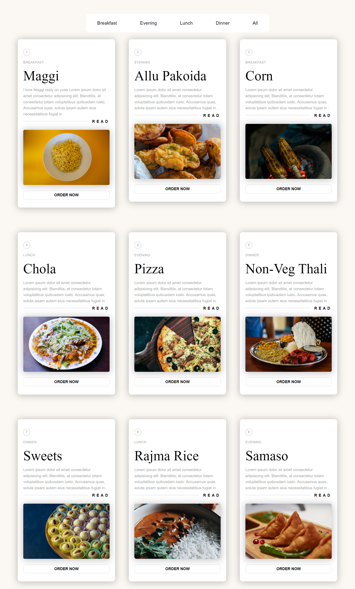
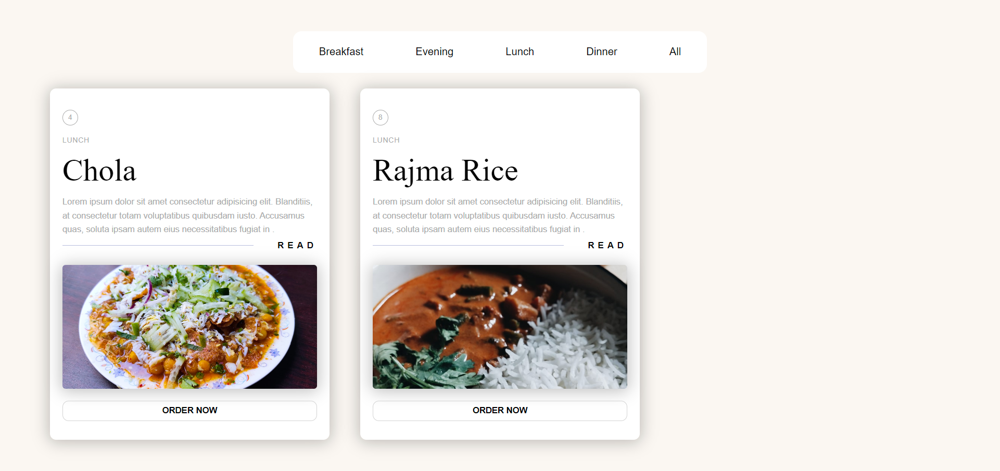

# Restaurent Website Using React

Built a restaurant menu website with filterable items using React JS. 

## Screenshots

## Website Links
- Live Link : [Click Here](https://react-basics-restaurent.netlify.app/)
- Solution :  [Click Here](https://github.com/Psargar616/react-restaurant)

## Learnings
- React basics
- Navbar menu with filters
- UseState hook

## Acknowledgements

Build this website after watching tutirial from [Thapa Technical](https://www.youtube.com/watch?v=EHTWMpD6S_0)

